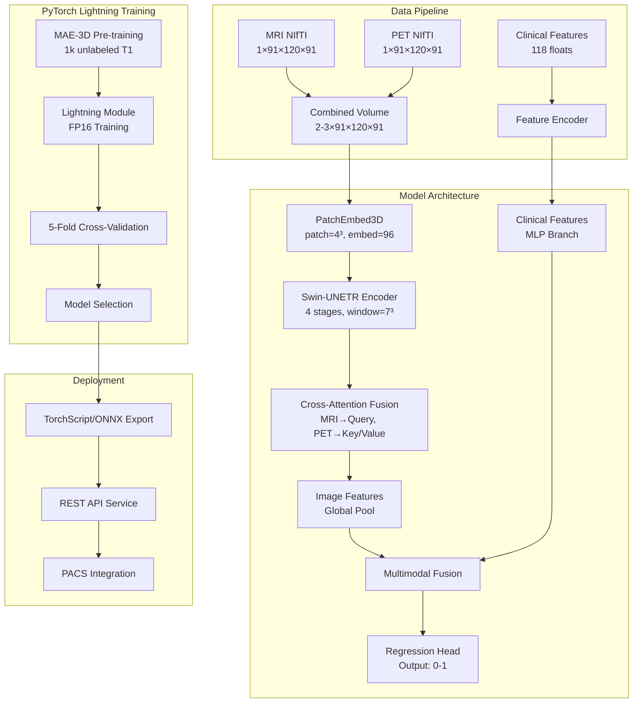

# Design Document

## Overview

The Early Alzheimer's Detection Model is a deep learning system that processes paired T1-weighted MRI and ^18F-FDG PET brain imaging volumes (each 1×91×120×91 in NIfTI format) along with 118 numerical clinical features to predict Alzheimer's disease progression as a continuous score (0-1). The system uses a Swin-UNETR backbone with cross-attention fusion and PyTorch Lightning with FP16 training to achieve clinical-grade performance (AUC ≥ 0.95, Sensitivity ≥ 88%, Specificity ≥ 89%) on ADNI/OASIS-3 datasets.

The architecture leverages transfer learning from MONAI's pre-trained Swin-UNETR weights and incorporates multimodal fusion through cross-attention mechanisms for imaging data, combined with a separate branch for numerical features. The system includes comprehensive preprocessing, training, evaluation, and deployment pipelines using PyTorch Lightning framework.

## Architecture

### System Architecture Diagram



### Model Architecture Details

The core model follows a multimodal hierarchical design:

1. **Input Processing**: 
   - Separate MRI (1×91×120×91) and PET (1×91×120×91) NIfTI volumes
   - Combined into 2-channel (MRI+PET) or 3-channel (MRI+PET+Difference) tensor
   - 118 numerical clinical features processed separately
2. **Image Branch**: 3D patches of size 4³ embedded into 96-dimensional vectors
3. **Swin-UNETR Encoder**: Hierarchical transformer with shifted windows for efficient 3D processing
4. **Cross-Attention Fusion**: Multimodal integration using attention mechanisms between MRI and PET
5. **Clinical Branch**: MLP processing of 118 numerical features
6. **Multimodal Fusion**: Combination of image and clinical features
7. **Regression Head**: Final prediction as continuous score (0-1) for Alzheimer's progression

## Components and Interfaces

### Data Processing Components

#### PreprocessingPipeline
```python
class PreprocessingPipeline:
    def __init__(self, target_spacing=(1.0, 1.0, 1.0), target_size=(91, 120, 91)):
        self.n4_corrector = N4BiasFieldCorrection()
        self.registrator = AffineRegistration(template="MNI152")
        self.resampler = Resample(target_spacing, target_size)
        self.normalizer = ZScoreNormalization()
    
    def __call__(self, mri_path: str, pet_path: str) -> torch.Tensor:
        # Load NIfTI files and combine into tensor of shape (2, 91, 120, 91) or (3, 91, 120, 91)
        mri_volume = self.load_and_preprocess_nifti(mri_path)  # (1, 91, 120, 91)
        pet_volume = self.load_and_preprocess_nifti(pet_path)  # (1, 91, 120, 91)
        
        # Combine volumes
        combined = torch.cat([mri_volume, pet_volume], dim=0)  # (2, 91, 120, 91)
        
        # Optionally add difference channel
        if self.include_difference:
            diff_channel = pet_volume - mri_volume
            combined = torch.cat([combined, diff_channel], dim=0)  # (3, 91, 120, 91)
            
        return combined
    
    def load_and_preprocess_nifti(self, nifti_path: str) -> torch.Tensor:
        # Load NIfTI, apply N4, register to MNI, resample, normalize
        pass
```

#### DataAugmentation
```python
class MedicalAugmentation:
    def __init__(self):
        self.transforms = Compose([
            RandAffined(keys=["image"], prob=0.8, rotate_range=0.175),  # ±10°
            RandFlipd(keys=["image"], prob=0.5, spatial_axis=0),
            RandBiasFieldd(keys=["image"], prob=0.3),
            MixUp(alpha=0.3, prob=0.3)
        ])
```

### Model Components

#### AlzheimersLightningModule
```python
class AlzheimersLightningModule(pl.LightningModule):
    def __init__(self, 
                 in_channels: int = 2,
                 clinical_features: int = 118,
                 feature_size: int = 96,
                 patch_size: Tuple[int, int, int] = (4, 4, 4),
                 learning_rate: float = 1e-4):
        
        super().__init__()
        self.save_hyperparameters()
        
        # Image processing branch
        self.patch_embed = PatchEmbed3D(patch_size, in_channels, feature_size)
        self.swin_encoder = SwinTransformer3D(
            embed_dim=feature_size,
            depths=[2, 2, 6, 2],
            num_heads=[3, 6, 12, 24],
            window_size=(7, 7, 7)
        )
        self.cross_attention = CrossModalAttention(
            embed_dim=feature_size,
            num_heads=2,
            head_dim=48
        )
        self.image_pool = nn.AdaptiveAvgPool3d(1)
        
        # Clinical features branch
        self.clinical_encoder = nn.Sequential(
            nn.Linear(clinical_features, 256),
            nn.ReLU(),
            nn.Dropout(0.3),
            nn.Linear(256, 128),
            nn.ReLU(),
            nn.Dropout(0.3),
            nn.Linear(128, 64)
        )
        
        # Multimodal fusion and regression head
        self.fusion = nn.Sequential(
            nn.Linear(feature_size + 64, 256),
            nn.ReLU(),
            nn.Dropout(0.5),
            nn.Linear(256, 128),
            nn.ReLU(),
            nn.Dropout(0.3),
            nn.Linear(128, 1),
            nn.Sigmoid()  # Output between 0-1
        )
        
        self.criterion = nn.MSELoss()
        
    def forward(self, images: torch.Tensor, clinical: torch.Tensor) -> torch.Tensor:
        # Process images through Swin-UNETR
        image_features = self.patch_embed(images)
        image_features = self.swin_encoder(image_features)
        image_features = self.cross_attention(image_features)
        image_features = self.image_pool(image_features).flatten(1)
        
        # Process clinical features
        clinical_features = self.clinical_encoder(clinical)
        
        # Fuse and predict
        combined = torch.cat([image_features, clinical_features], dim=1)
        output = self.fusion(combined)
        return output
        
    def training_step(self, batch, batch_idx):
        images, clinical, targets = batch
        predictions = self(images, clinical)
        loss = self.criterion(predictions.squeeze(), targets)
        
        self.log('train_loss', loss, prog_bar=True)
        return loss
        
    def validation_step(self, batch, batch_idx):
        images, clinical, targets = batch
        predictions = self(images, clinical)
        loss = self.criterion(predictions.squeeze(), targets)
        
        self.log('val_loss', loss, prog_bar=True)
        return {'val_loss': loss, 'predictions': predictions, 'targets': targets}
        
    def configure_optimizers(self):
        optimizer = torch.optim.AdamW(
            self.parameters(),
            lr=self.hparams.learning_rate,
            weight_decay=1e-2
        )
        scheduler = torch.optim.lr_scheduler.CosineAnnealingLR(
            optimizer, T_max=100
        )
        return [optimizer], [scheduler]
```

#### CrossModalAttention
```python
class CrossModalAttention(nn.Module):
    def __init__(self, embed_dim: int, num_heads: int, head_dim: int):
        self.mri_query_proj = nn.Linear(embed_dim, num_heads * head_dim)
        self.pet_key_proj = nn.Linear(embed_dim, num_heads * head_dim)
        self.pet_value_proj = nn.Linear(embed_dim, num_heads * head_dim)
        self.multihead_attn = nn.MultiheadAttention(
            embed_dim=num_heads * head_dim,
            num_heads=num_heads,
            batch_first=True
        )
```

### Training Components

#### TrainingPipeline
```python
class TrainingPipeline:
    def __init__(self, config: TrainingConfig):
        self.model = SwinUNETRWithFusion(**config.model_params)
        self.criterion = CombinedLoss(
            ce_weight=1.0,
            focal_weight=0.25,
            focal_gamma=2.0
        )
        self.optimizer = torch.optim.AdamW(
            self.model.parameters(),
            lr=1e-4,
            weight_decay=1e-2
        )
        self.scheduler = CosineAnnealingLR(self.optimizer, T_max=config.epochs)
        self.early_stopping = EarlyStopping(patience=10, monitor='val_auc')
```

#### MAEPretraining
```python
class MAE3DPretraining:
    def __init__(self, encoder: nn.Module, mask_ratio: float = 0.75):
        self.encoder = encoder
        self.decoder = MAEDecoder3D()
        self.mask_ratio = mask_ratio
    
    def forward(self, x: torch.Tensor) -> Tuple[torch.Tensor, torch.Tensor]:
        # Returns reconstruction loss and latent features
        pass
```

### Evaluation Components

#### CrossValidationEvaluator
```python
class CrossValidationEvaluator:
    def __init__(self, n_folds: int = 5, stratify: bool = True):
        self.n_folds = n_folds
        self.stratify = stratify
        self.metrics = {
            'auc': AUROC(num_classes=3, average='macro'),
            'sensitivity': Recall(num_classes=3, average='macro'),
            'specificity': Specificity(num_classes=3, average='macro'),
            'accuracy': Accuracy(num_classes=3)
        }
```

#### ExplainabilityAnalyzer
```python
class ExplainabilityAnalyzer:
    def __init__(self, model: nn.Module):
        self.model = model
        self.attention_rollout = AttentionRollout()
        self.integrated_gradients = IntegratedGradients(model)
    
    def generate_explanations(self, input_tensor: torch.Tensor) -> Dict[str, torch.Tensor]:
        return {
            'attention_maps': self.attention_rollout(input_tensor),
            'gradient_maps': self.integrated_gradients.attribute(input_tensor),
            'anatomical_regions': self.map_to_anatomy(attention_maps)
        }
```

## Data Models

### Core Data Structures

#### Subject
```python
@dataclass
class Subject:
    subject_id: str
    age: float
    sex: str
    alzheimer_score: float  # Continuous score 0-1
    mri_path: Path  # NIfTI file path
    pet_path: Path  # NIfTI file path
    clinical_features: np.ndarray  # 118 numerical features
    acquisition_date: datetime
    scanner_info: Dict[str, Any]
    
    def validate(self) -> bool:
        return (
            self.mri_path.exists() and 
            self.pet_path.exists() and
            0.0 <= self.alzheimer_score <= 1.0 and
            len(self.clinical_features) == 118
        )
```

#### Dataset
```python
class AlzheimersDataset(torch.utils.data.Dataset):
    def __init__(self, 
                 subjects: List[Subject],
                 preprocessing_pipeline: PreprocessingPipeline,
                 augmentation: Optional[MedicalAugmentation] = None,
                 include_difference_channel: bool = False):
        
        self.subjects = subjects
        self.preprocessing = preprocessing_pipeline
        self.augmentation = augmentation
        self.include_diff = include_difference_channel
        
    def __getitem__(self, idx: int) -> Tuple[torch.Tensor, torch.Tensor, torch.Tensor]:
        subject = self.subjects[idx]
        
        # Load and preprocess volumes
        volume = self.preprocessing(subject.mri_path, subject.pet_path)
        
        if self.include_diff:
            diff_channel = volume[1] - volume[0]  # PET - MRI
            volume = torch.cat([volume, diff_channel.unsqueeze(0)], dim=0)
        
        if self.augmentation and self.training:
            volume = self.augmentation(volume)
        
        # Clinical features and target score
        clinical_features = torch.tensor(subject.clinical_features, dtype=torch.float32)
        target_score = torch.tensor(subject.alzheimer_score, dtype=torch.float32)
        
        return volume, clinical_features, target_score
    
    def __len__(self) -> int:
        return len(self.subjects)
```

### Configuration Models

#### TrainingConfig
```python
@dataclass
class TrainingConfig:
    # Model parameters
    model_params: Dict[str, Any]
    
    # Training parameters
    batch_size: int = 4
    gradient_accumulation_steps: int = 8
    learning_rate: float = 1e-4
    weight_decay: float = 1e-2
    epochs: int = 100
    
    # Loss parameters
    focal_gamma: float = 2.0
    focal_weight: float = 0.25
    
    # Pretraining parameters
    pretrain_epochs: int = 300
    pretrain_mask_ratio: float = 0.75
    
    # Early stopping
    patience: int = 10
    monitor_metric: str = 'val_auc'
    
    # Hardware
    device: str = 'cuda'
    mixed_precision: bool = True
```

## Error Handling

### Exception Hierarchy

```python
class AlzheimersDetectionError(Exception):
    """Base exception for Alzheimer's detection system"""
    pass

class PreprocessingError(AlzheimersDetectionError):
    """Raised when preprocessing fails"""
    pass

class ModelError(AlzheimersDetectionError):
    """Raised when model operations fail"""
    pass

class ValidationError(AlzheimersDetectionError):
    """Raised when validation fails"""
    pass

class InferenceError(AlzheimersDetectionError):
    """Raised during inference"""
    pass
```

### Error Handling Strategy

1. **Data Validation**: Comprehensive checks for file existence, format compatibility, and data integrity
2. **Graceful Degradation**: System continues with reduced functionality when non-critical components fail
3. **Logging**: Structured logging with different levels (DEBUG, INFO, WARNING, ERROR, CRITICAL)
4. **Recovery Mechanisms**: Automatic retry for transient failures, checkpoint recovery for training interruptions
5. **User Feedback**: Clear error messages with actionable suggestions for resolution

### Monitoring and Alerting

```python
class SystemMonitor:
    def __init__(self):
        self.metrics_collector = MetricsCollector()
        self.alert_manager = AlertManager()
    
    def check_data_drift(self, new_batch: torch.Tensor) -> bool:
        # Detect distribution shifts in input data
        pass
    
    def monitor_model_performance(self, predictions: torch.Tensor, 
                                targets: torch.Tensor) -> Dict[str, float]:
        # Track performance degradation
        pass
```

## Testing Strategy

### Unit Testing

1. **Component Testing**: Individual modules (preprocessing, model components, evaluation metrics)
2. **Data Pipeline Testing**: Validation of data loading, augmentation, and preprocessing
3. **Model Architecture Testing**: Forward pass validation, gradient flow verification
4. **Utility Function Testing**: Helper functions, configuration parsing, file I/O

### Integration Testing

1. **End-to-End Pipeline**: Complete workflow from raw data to predictions
2. **Cross-Validation Testing**: Proper fold generation and evaluation
3. **Checkpoint Loading**: Model state persistence and restoration
4. **API Integration**: REST endpoints and PACS connectivity

### Performance Testing

1. **Memory Profiling**: GPU memory usage optimization
2. **Inference Speed**: Latency benchmarking for clinical requirements
3. **Scalability Testing**: Batch processing capabilities
4. **Resource Utilization**: CPU/GPU efficiency monitoring

### Clinical Validation

1. **Benchmark Comparison**: Performance against SOTA methods
2. **Statistical Significance**: Proper statistical testing of results
3. **Explainability Validation**: Clinical review of attention maps
4. **Robustness Testing**: Performance across different scanners and protocols

### Test Data Strategy

```python
class TestDataManager:
    def __init__(self):
        self.synthetic_generator = SyntheticBrainGenerator()
        self.holdout_sets = {
            'unit_test': 'small synthetic dataset',
            'integration_test': 'subset of real data',
            'performance_test': 'full validation set',
            'clinical_validation': 'independent test cohort'
        }
    
    def generate_test_cases(self, test_type: str) -> List[Subject]:
        # Generate appropriate test data for different testing scenarios
        pass
```

This design provides a comprehensive foundation for implementing the Early Alzheimer's Detection Model with proper separation of concerns, robust error handling, and thorough testing strategies.