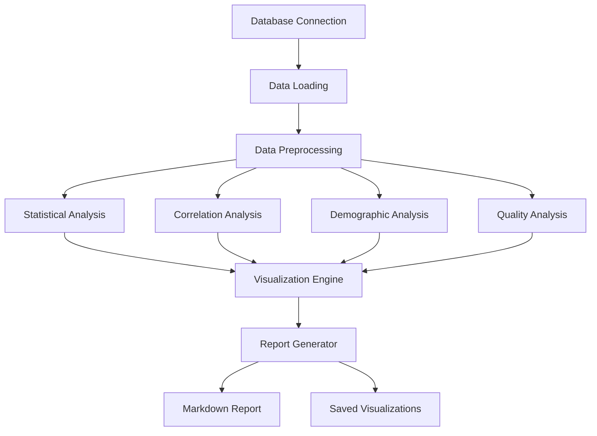

# Design Document

## Overview

The Gazimed Data Analysis System is designed as a comprehensive Python-based analysis toolkit that generates detailed statistical reports, visualizations, and insights about the Alzheimer's disease detection database. The system will produce a complete markdown report with embedded visualizations, statistical summaries, and actionable recommendations for model development.

## Architecture

### Core Components

1. **DataAnalyzer Class**: Main analysis engine that coordinates all analysis tasks
2. **StatisticalAnalyzer**: Handles descriptive statistics, distributions, and hypothesis testing
3. **CorrelationAnalyzer**: Manages feature correlation analysis and visualization
4. **DemographicAnalyzer**: Processes demographic data with 5-bin age stratification
5. **QualityAnalyzer**: Assesses data quality, completeness, and integrity
6. **VisualizationEngine**: Creates and saves all charts and plots
7. **ReportGenerator**: Produces the final markdown report with embedded results

### Data Flow



## Components and Interfaces

### 1. DataAnalyzer (Main Class)

```python
class GazimedDataAnalyzer:
    def __init__(self, db_path: str)
    def load_data(self) -> pd.DataFrame
    def run_complete_analysis(self) -> Dict[str, Any]
    def generate_report(self, output_path: str) -> None
```

**Responsibilities:**
- Coordinate all analysis components
- Manage data loading and preprocessing
- Generate final comprehensive report

### 2. StatisticalAnalyzer

```python
class StatisticalAnalyzer:
    def analyze_distributions(self, df: pd.DataFrame) -> Dict[str, Any]
    def calculate_descriptive_stats(self, df: pd.DataFrame) -> Dict[str, Any]
    def identify_outliers(self, df: pd.DataFrame) -> Dict[str, Any]
    def test_normality(self, df: pd.DataFrame) -> Dict[str, Any]
```

**Key Features:**
- Descriptive statistics for all numerical variables
- Distribution analysis with normality tests
- Outlier detection using IQR and Z-score methods
- Statistical significance testing

### 3. CorrelationAnalyzer

```python
class CorrelationAnalyzer:
    def calculate_feature_correlations(self, df: pd.DataFrame) -> Dict[str, Any]
    def find_top_correlations(self, correlations: np.ndarray) -> List[Tuple]
    def identify_multicollinearity(self, df: pd.DataFrame) -> Dict[str, Any]
    def analyze_target_correlations(self, df: pd.DataFrame) -> Dict[str, Any]
```

**Key Features:**
- Pearson and Spearman correlation matrices
- Feature ranking by correlation with target variable
- Multicollinearity detection (VIF analysis)
- Feature redundancy identification

### 4. DemographicAnalyzer

```python
class DemographicAnalyzer:
    def create_age_bins(self, df: pd.DataFrame, n_bins: int = 5) -> pd.DataFrame
    def analyze_age_distribution(self, df: pd.DataFrame) -> Dict[str, Any]
    def analyze_sex_distribution(self, df: pd.DataFrame) -> Dict[str, Any]
    def compare_dataset_sources(self, df: pd.DataFrame) -> Dict[str, Any]
    def cross_tabulate_demographics(self, df: pd.DataFrame) -> Dict[str, Any]
```

**Key Features:**
- 5-bin age stratification with equal-sized groups
- Gender-based analysis with statistical testing
- Dataset source comparison (ADNI vs GAZI)
- Cross-tabulation of demographic variables

### 5. QualityAnalyzer

```python
class QualityAnalyzer:
    def assess_missing_data(self, df: pd.DataFrame) -> Dict[str, Any]
    def validate_file_paths(self, df: pd.DataFrame) -> Dict[str, Any]
    def check_data_consistency(self, df: pd.DataFrame) -> Dict[str, Any]
    def calculate_completeness_scores(self, df: pd.DataFrame) -> Dict[str, Any]
```

**Key Features:**
- Missing data analysis with patterns
- File accessibility validation
- Data consistency checks
- Completeness scoring system

### 6. VisualizationEngine

```python
class VisualizationEngine:
    def create_distribution_plots(self, data: Dict, output_dir: str) -> List[str]
    def create_correlation_heatmaps(self, data: Dict, output_dir: str) -> List[str]
    def create_demographic_charts(self, data: Dict, output_dir: str) -> List[str]
    def create_quality_visualizations(self, data: Dict, output_dir: str) -> List[str]
```

**Visualization Types:**
- Histograms and box plots for distributions
- Correlation heatmaps and scatter plots
- Bar charts and pie charts for categorical data
- Missing data patterns and quality metrics

## Data Models

### Analysis Results Structure

```python
@dataclass
class AnalysisResults:
    statistical_summary: Dict[str, Any]
    correlation_analysis: Dict[str, Any]
    demographic_analysis: Dict[str, Any]
    quality_assessment: Dict[str, Any]
    visualizations: List[str]
    metadata: Dict[str, Any]
```

### Age Binning Strategy

- **Method**: Equal-frequency binning (quintiles)
- **Bins**: 5 age groups with approximately equal sample sizes
- **Labels**: "Very Young", "Young", "Middle", "Old", "Very Old"
- **Analysis**: Alzheimer's rate and clinical feature means per bin

## Error Handling

### Data Loading Errors
- Database connection failures
- Missing or corrupted data files
- Schema validation errors

### Analysis Errors
- Insufficient data for statistical tests
- Numerical computation errors
- Visualization generation failures

### Recovery Strategies
- Graceful degradation with partial results
- Detailed error logging and reporting
- Alternative analysis methods when primary methods fail

## Testing Strategy

### Unit Tests
- Individual analyzer component testing
- Statistical calculation validation
- Visualization generation testing

### Integration Tests
- End-to-end analysis pipeline testing
- Report generation validation
- Cross-component data flow testing

### Data Validation Tests
- Known dataset result verification
- Statistical accuracy validation
- Visualization content verification

## Performance Considerations

### Memory Management
- Chunked processing for large datasets
- Efficient data structures for clinical features
- Memory-mapped file access for large arrays

### Computation Optimization
- Vectorized operations using NumPy/Pandas
- Parallel processing for independent analyses
- Caching of intermediate results

### Output Optimization
- Compressed image formats for visualizations
- Efficient markdown generation
- Incremental report building