# Gazimed: Early Alzheimer's Disease Detection System

**Advanced AI-powered early detection of Alzheimer's disease using paired MRI and PET brain imaging**

---

## 🧠 Clinical Overview

Gazimed is a state-of-the-art deep learning system designed to assist clinicians in the early detection of Alzheimer's disease. By analyzing paired T1-weighted MRI and ^18F-FDG PET brain scans alongside clinical features, our system provides continuous risk scores (0-1) to support clinical decision-making.

### Key Clinical Benefits

- **Early Detection**: Identifies Alzheimer's risk before severe cognitive decline
- **Multimodal Analysis**: Combines structural (MRI) and metabolic (PET) brain imaging
- **Clinical Integration**: Incorporates 118 clinical features for comprehensive assessment
- **Explainable AI**: Provides attention maps highlighting relevant brain regions
- **Validated Approach**: Built on established medical imaging datasets (ADNI, OASIS-3)

---

## 🔬 How It Works


### Technical Architecture

1. **Preprocessing**: N4 bias correction, MNI152 registration, normalization
2. **Feature Extraction**: 3D Swin Transformer with shifted window attention
3. **Multimodal Fusion**: Cross-attention between MRI/PET and clinical data
4. **Risk Assessment**: Continuous score output with confidence intervals
5. **Explainability**: Attention visualization for clinical interpretation

---

## 📊 Target Clinical Performance

We aim to achieve the following performance metrics through our validation studies:

| Metric | Target Performance | Clinical Significance |
|--------|-------------------|----------------------|
| **AUC-ROC** | 0.90+ | Excellent discrimination ability |
| **Sensitivity** | 85%+ | High detection of positive cases |
| **Specificity** | 85%+ | Low false positive rate |
| **Correlation** | r = 0.80+ | Strong agreement with clinical scores |

### Validation Datasets
- **ADNI**: Alzheimer's Disease Neuroimaging Initiative
- **OASIS-3**: Open Access Series of Imaging Studies
- **AIBL**: Australian Imaging, Biomarker & Lifestyle Study

---

## 🏥 Clinical Workflow Integration


### Integration Points
- **PACS Integration**: Direct DICOM import from imaging systems
- **EMR Compatibility**: Clinical feature extraction from electronic records
- **Reporting**: Structured reports with attention visualizations
- **Quality Assurance**: Built-in validation and quality checks

---

## 🔍 Explainable AI Features

### Attention Visualization
The system provides clinically interpretable attention maps highlighting:

- **Hippocampus**: Memory formation and early AD pathology
- **Entorhinal Cortex**: Gateway to hippocampal formation
- **Posterior Cingulate**: Default mode network alterations
- **Precuneus**: Early metabolic changes in AD

### Clinical Validation Tools
- Anatomical region overlap metrics
- Attention consistency across similar cases
- Correlation with known AD biomarkers
- Comparison with radiologist assessments

---

## 🚀 Getting Started

### System Requirements

**Hardware:**
- GPU: NVIDIA RTX 3080 or better (12GB+ VRAM recommended)
- RAM: 32GB+ for processing full-resolution volumes
- Storage: 500GB+ for datasets and models

**Software:**
- Python 3.8+
- CUDA 11.8+
- Docker (optional, for containerized deployment)

### Quick Installation

```bash
# Clone the repository
git clone https://github.com/gazimed/alzheimers-detection.git
cd alzheimers-detection

# Install dependencies
pip install -e .

# Initialize database
gazimed-init --setup-database

# Download pretrained models
gazimed-download --model swin-unetr-pretrained
```

### Basic Usage

```python
from gazimed import AlzheimersDetector

# Initialize the detector
detector = AlzheimersDetector.from_pretrained('swin-unetr-v1.0')

# Analyze a case
result = detector.predict(
    mri_path='patient_001_T1.nii.gz',
    pet_path='patient_001_FDG.nii.gz',
    clinical_features=clinical_data
)

print(f"Alzheimer's Risk Score: {result.risk_score:.3f}")
print(f"Confidence Interval: [{result.ci_lower:.3f}, {result.ci_upper:.3f}]")

# Generate clinical report
report = detector.generate_report(result)
report.save('patient_001_report.pdf')
```

---

## 📈 Model Performance Details

### Target Cross-Validation Results


### Target Comparison with Baseline Methods

| Method | Target AUC | Target Sensitivity | Target Specificity | Notes |
|--------|------------|-------------------|-------------------|-------|
| **Gazimed (Goal)** | **0.90+** | **85%+** | **85%+** | Multimodal + Clinical |
| ResNet3D (Baseline) | 0.85 | 82% | 83% | MRI only |
| CNN + PET (Baseline) | 0.87 | 84% | 85% | Imaging only |
| Clinical Features | 0.78 | 75% | 79% | Traditional approach |
| Radiologist | 0.83 | 79% | 86% | Human expert |

---

## 🔧 Technical Architecture Deep Dive

### Model Pipeline Overview

```mermaid
graph TB
    subgraph "Input Processing"
        A[MRI T1-weighted<br/>Raw DICOM] --> A1[N4 Bias Correction]
        B[PET FDG<br/>Raw DICOM] --> B1[N4 Bias Correction]
        C[Clinical Features<br/>118 parameters] --> C1[Feature Normalization]
        
        A1 --> A2[MNI152 Registration]
        B1 --> B2[MNI152 Registration]
        
        A2 --> A3[Resampling to 1mm³]
        B2 --> B3[Resampling to 1mm³]
        
        A3 --> A4[Z-score Normalization]
        B3 --> B4[Z-score Normalization]
    end
    
    subgraph "Feature Extraction"
        A4 --> D[3D Swin-UNETR<br/>Encoder]
        B4 --> D
        C1 --> E[Clinical Feature<br/>Encoder]
        
        D --> F[Spatial Features<br/>2048-dim]
        E --> G[Clinical Features<br/>512-dim]
    end
    
    subgraph "Multimodal Fusion"
        F --> H[Cross-Modal<br/>Attention Layer]
        G --> H
        
        H --> I[Feature Fusion<br/>1024-dim]
        I --> J[Classification Head]
    end
    
    subgraph "Output"
        J --> K[Risk Score<br/>0.0 - 1.0]
        J --> L[Attention Maps<br/>Explainability]
        J --> M[Confidence Score<br/>Uncertainty]
    end
    
    style A fill:#e3f2fd
    style B fill:#f3e5f5
    style C fill:#e8f5e8
    style K fill:#fff3e0
    style L fill:#fce4ec
    style M fill:#f1f8e9
```



### Data Processing Pipeline

| Stage | Input | Process | Output | Purpose |
|-------|-------|---------|--------|---------|
| **Preprocessing** | Raw DICOM | N4 correction, MNI registration | Normalized volumes | Standardization |
| **Feature Extraction** | 3D volumes | 3D Swin-UNETR backbone | Spatial features | Pattern recognition |
| **Clinical Encoding** | 118 features | Multi-layer perceptron | Clinical embeddings | Risk factor encoding |
| **Multimodal Fusion** | All features | Cross-attention mechanism | Fused representation | Information integration |
| **Classification** | Fused features | Regression head | Risk score + uncertainty | Final prediction |

### Model Components Breakdown

#### 3D Swin-UNETR Architecture
```
Input: [B, 2, 91, 109, 91] (MRI + PET)
├── Patch Embedding: 4×4×4 patches → 768-dim
├── Swin Transformer Blocks (4 stages)
│   ├── Stage 1: 96-dim, 2×2×2 patches
│   ├── Stage 2: 192-dim, 4×4×4 patches  
│   ├── Stage 3: 384-dim, 8×8×8 patches
│   └── Stage 4: 768-dim, 16×16×16 patches
├── Skip Connections for U-Net structure
└── Output: [B, 2048] feature vector
```

#### Clinical Feature Encoder
```
Input: [B, 118] clinical features
├── Layer 1: 118 → 512 (ReLU + Dropout)
├── Layer 2: 512 → 256 (ReLU + Dropout)
├── Layer 3: 256 → 128 (ReLU + Dropout)
└── Output: [B, 512] clinical embeddings
```

---

## 📊 Training & Validation Process

### Training Configuration

| Parameter | Value | Description |
|-----------|-------|-------------|
| **Optimizer** | AdamW | Weight decay: 0.01 |
| **Learning Rate** | 1e-4 | Cosine annealing schedule |
| **Batch Size** | 2-8 | Flexible based on GPU memory |
| **Mixed Precision** | FP16 | Memory optimization |
| **Gradient Accumulation** | 8 steps | Effective larger batch size |
| **Data Augmentation** | 3D transforms | Rotation, scaling, noise |
| **Cross-Validation** | 5-fold | Stratified by diagnosis |

### Performance Metrics


---

## 🚀 Getting Started

### Model Checkpoints

| Model Version | Performance | Download | Size |
|---------------|-------------|----------|------|
| **v1.0-base** | AUC: 0 | [WILL BE UPLOADED](https://releases/v1.0-base.ckpt) | 245 MB |
| **v1.1-enhanced** | AUC: 0 | [WILL BE UPLOADED](https://releases/v1.1-enhanced.ckpt) | 267 MB |
| **v2.0-multimodal** | AUC: 0 | [WILL BE UPLOADED](https://releases/v2.0-multimodal.ckpt) | 312 MB |

---

## 📄 License

This project is licensed under the MIT License - see the [LICENSE](LICENSE) file for details.

---

*Gazimed - Advancing early Alzheimer's detection through AI innovation* 🧠✨