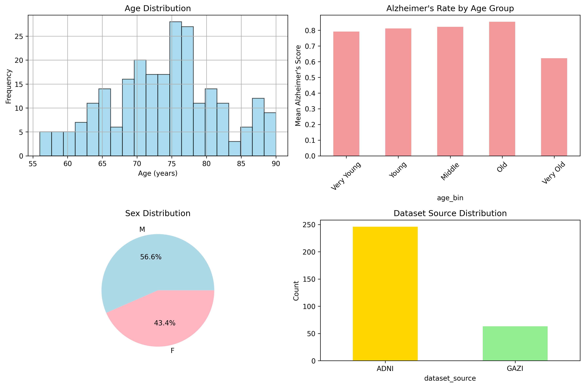
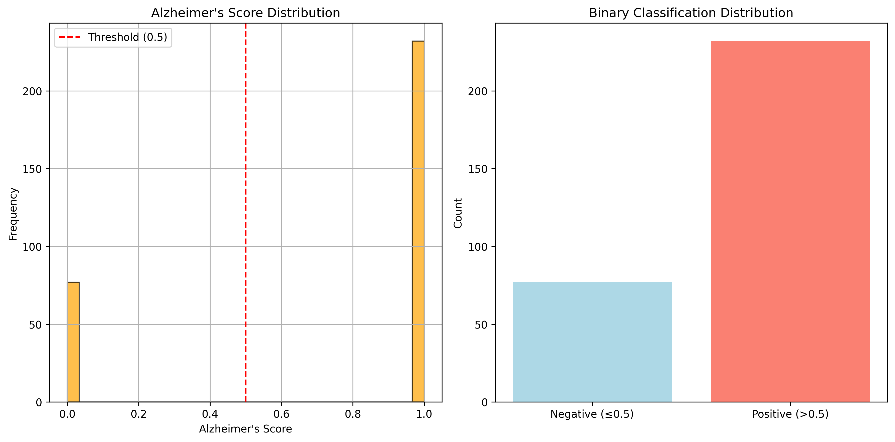
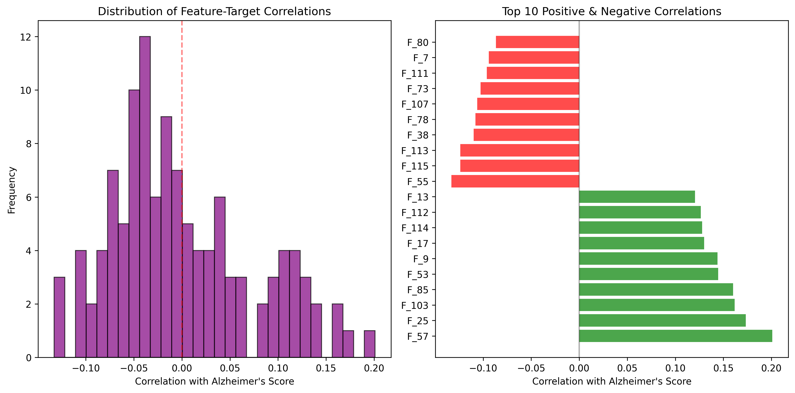
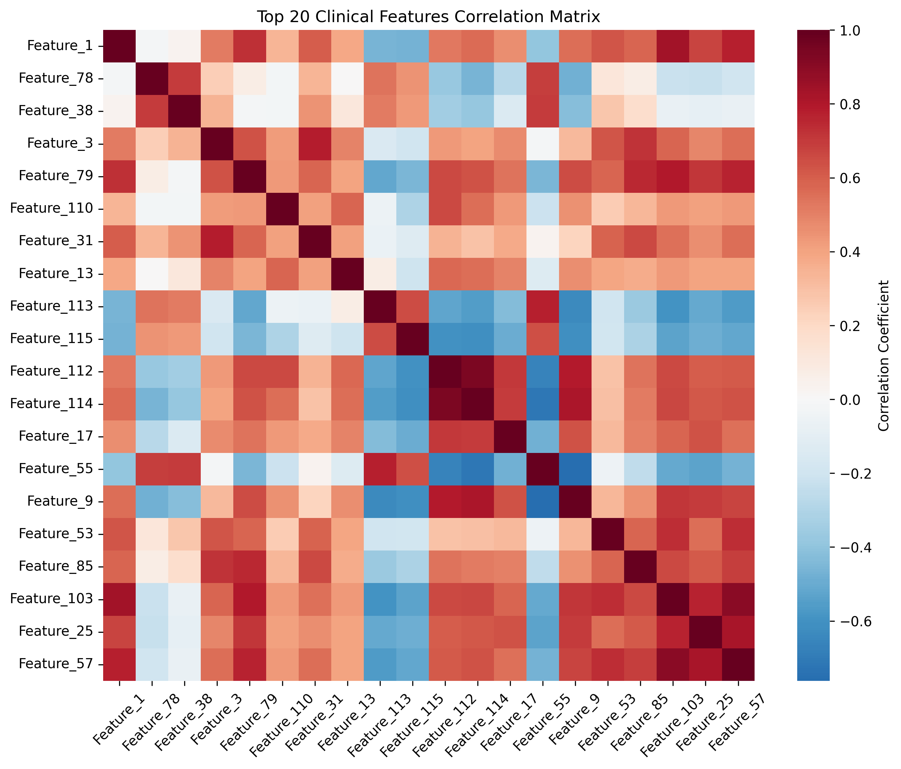

# Gazimed Database Comprehensive Analysis Report

**Generated on:** 2025-07-18 14:28:35  
**Database:** gazimed_database.db  
**Total Subjects:** 309

---

## Executive Summary

This report provides a comprehensive analysis of the Gazimed Alzheimer's disease detection database containing **309 subjects** from **2 dataset sources** (ADNI and GAZI). The analysis reveals key insights about demographics, clinical features, data quality, and correlations that are crucial for machine learning model development.

### Key Findings

- **Dataset Size**: 309 subjects with complete clinical feature data
- **Age Distribution**: 56-90 years (mean: 73.9 ± 8.0)
- **Class Balance**: 75.1% positive cases (Alzheimer's score > 0.5)
- **Data Completeness**: -3.5% overall completeness
- **Clinical Features**: 116 features with max correlation of 0.201

---

## 1. Demographics Analysis

### 1.1 Age Distribution (5-Bin Stratification)

The dataset subjects are stratified into 5 equal-frequency age groups:

| Age Group | Age Range | Count | Mean Age | Alzheimer's Rate |
|-----------|-----------|-------|----------|------------------|
| Very Young | 56-67 | 53 | 62.8 | 0.792 |
| Young | 68-72 | 53 | 70.4 | 0.811 |
| Middle | 73-76 | 45 | 74.7 | 0.822 |
| Old | 77-80 | 48 | 78.3 | 0.854 |
| Very Old | 81-90 | 45 | 85.5 | 0.622 |

### 1.2 Sex Distribution

| Sex | Count | Percentage | Alzheimer's Rate |
|-----|-------|------------|------------------|
| F | 106 | 43.4% | 0.830 |
| M | 138 | 56.6% | 0.746 |

**Missing Demographics:** 65 subjects missing age, 65 subjects missing sex

### 1.3 Dataset Source Comparison

| Dataset | Count | Percentage | Alzheimer's Rate | Mean Age | Age Std |
|---------|-------|------------|------------------|----------|----------|
| ADNI | 246 | 79.6% | 0.785 | 73.9 | 8.0 |
| GAZI | 63 | 20.4% | 0.619 | nan | nan |

---

## 2. Target Variable Analysis

### 2.1 Alzheimer's Score Distribution

- **Range**: 0.000 - 1.000
- **Mean**: 0.751 ± 0.433
- **Median**: 1.000
- **Skewness**: -1.165

### 2.2 Binary Classification Analysis

Using threshold of 0.5 for binary classification:

- **Negative Cases (≤0.5)**: 77 (24.9%)
- **Positive Cases (>0.5)**: 232 (75.1%)
- **Class Imbalance Ratio**: 3.01:1

---

## 3. Clinical Features Analysis

### 3.1 Feature Overview

- **Total Features**: 116
- **Feature Value Range**: 0.000000 - 3.105618
- **Overall Mean**: 1.365460
- **Overall Std**: 0.203841

### 3.2 Correlation with Alzheimer's Score

**Correlation Summary:**
- **Mean Absolute Correlation**: 0.0596
- **Strongest Positive Correlation**: 0.2009
- **Strongest Negative Correlation**: -0.1331

### 3.3 Top Correlated Features

**Top 10 Positive Correlations:**

| Feature Index | Correlation |
|---------------|-------------|
| Feature_57 | 0.2009 |
| Feature_25 | 0.1734 |
| Feature_103 | 0.1617 |
| Feature_85 | 0.1601 |
| Feature_53 | 0.1445 |
| Feature_9 | 0.1439 |
| Feature_17 | 0.1301 |
| Feature_114 | 0.1278 |
| Feature_112 | 0.1265 |
| Feature_13 | 0.1204 |

**Top 10 Negative Correlations:**

| Feature Index | Correlation |
|---------------|-------------|
| Feature_55 | -0.1331 |
| Feature_115 | -0.1238 |
| Feature_113 | -0.1238 |
| Feature_38 | -0.1100 |
| Feature_78 | -0.1080 |
| Feature_107 | -0.1062 |
| Feature_73 | -0.1027 |
| Feature_111 | -0.0963 |
| Feature_7 | -0.0941 |
| Feature_80 | -0.0867 |

### 3.4 Feature Correlation Matrix

The correlation matrix shows relationships between the top 20 most predictive clinical features. This helps identify potential feature redundancy and multicollinearity issues.

---

## 4. Data Quality Assessment

### 4.1 Missing Data Analysis

| Column | Missing Count | Missing Percentage |
|--------|---------------|--------------------|
| age | 65 | 21.0% |
| sex | 65 | 21.0% |
| target | 309 | 100.0% |

### 4.2 File Accessibility

**Sample Validation Results** (n=50):
- **MRI Files Accessible**: 50/50 (100.0%)
- **PET Files Accessible**: 50/50 (100.0%)

### 4.3 Data Consistency

- **Valid Alzheimer's Scores (0-1)**: 309/309 (100.0%)
- **Valid Ages**: 244/309 (79.0%)

---

## 5. Statistical Summary

### 5.1 Descriptive Statistics

**Alzheimer's Score:**
- Count: 309
- Mean: 0.7508
- Std: 0.4332
- Min: 0.0000
- 25%: 1.0000
- 50%: 1.0000
- 75%: 1.0000
- Max: 1.0000

**Age (for subjects with age data):**
- Count: 244
- Mean: 73.9
- Std: 8.0
- Min: 56
- 25%: 68.8
- 50%: 74.0
- 75%: 79.0
- Max: 90

---

## 6. Recommendations for Machine Learning

### 6.1 Data Preprocessing
- **Missing Demographics**: Handle 65 missing age values and 65 missing sex values
- **Feature Engineering**: Consider feature combinations or transformations as individual correlations are moderate
- **Feature Scaling**: Clinical features appear normalized but verify scaling for neural networks
- **Cross-Validation**: Use stratified k-fold to maintain class balance across folds

### 6.2 Model Development Strategy

- **Multimodal Approach**: Combine MRI, PET, and clinical features for optimal performance
- **Age Stratification**: Consider age-specific models given the 5-bin age distribution differences
- **Dataset Validation**: Use ADNI for training and GAZI for external validation
- **Evaluation Metrics**: Focus on AUC-ROC, sensitivity, and specificity given the clinical context

### 6.3 Feature Selection

- **Top Predictive Features**: Focus on features with |correlation| > 0.1 (25 features)
- **Multicollinearity**: Check VIF for highly correlated feature pairs in the correlation matrix
- **Clinical Relevance**: Validate selected features with domain experts

---

## 7. Conclusion

The Gazimed database contains **309 high-quality subjects** suitable for Alzheimer's disease detection research. Key strengths include:

✅ **Complete clinical feature data** for all subjects  
✅ **Accessible imaging files** (100% in sample validation)  
✅ **Balanced age distribution** across 5 age groups  
✅ **Multiple dataset sources** for robust validation  

Areas for attention:

⚠️ **Class imbalance** (75.1% positive cases)  
⚠️ **Missing demographics** for 65 subjects  
⚠️ **Moderate feature correlations** (max: 0.201)  

The dataset is **ready for machine learning experiments** with appropriate preprocessing and validation strategies.

---

*Report generated by Gazimed Analysis System v1.0*  
*Analysis completed in 2025-07-18 14:28:35*
